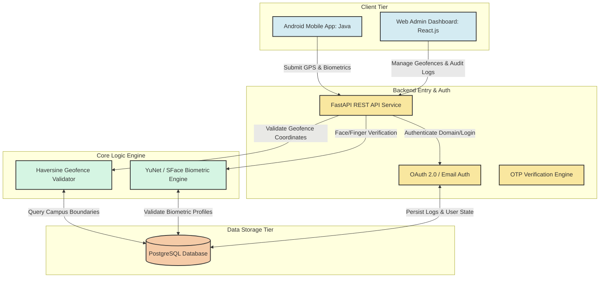

<div align="center">

# 📍 Geo-Attend

### Next-Generation Geofenced & Biometric Attendance Management System

[](https://www.python.org/)
[](https://fastapi.tiangolo.com/)
[](https://react.dev/)
[](https://developer.android.com/)
[](https://www.postgresql.org/)
[](https://opencv.org/)

[Features](#-key-features) • [Architecture](#-system-architecture) • [Setup Guide](SETUP.md) • [Database Schema](database.md) • [Project Structure](#-project-structure)

</div>

---

## 📖 Overview

**Geo-Attend** is an enterprise-grade attendance tracking solution designed to eliminate attendance fraud, proxy check-ins, and manual record-keeping. By combining **GPS Geofencing** (Haversine boundary verification) with **Biometric Authentication** (Android Hardware Fingerprint & OpenCV YuNet/SFace Face Recognition), Geo-Attend guarantees that attendance can only be logged when an employee is physically verified within authorized organizational boundaries.

The platform provides a complete ecosystem consisting of a **Native Android Client App** for field/office employees, a **FastAPI REST Service** for real-time verification and machine learning inference, and a modern **React Web Dashboard** for administrative supervision and support desk resolution.

---

## ✨ Key Features

- 🌐 **Haversine Geofence Verification:** Restricts attendance actions to dynamically managed campus boundaries and radius thresholds (meters).
- 👤 **Biometric Protection:** Integrates mobile fingerprint APIs and server-side facial recognition via OpenCV YuNet & SFace models to prevent proxy check-ins.
- 📊 **Real-Time Admin Dashboard:** Comprehensive React web console to view live attendance logs, register users, set campus parameters, and monitor security events.
- 🎫 **Support & Feedback Desk:** Built-in ticketing engine enabling employees to submit support queries and feedback directly to administrators.
- 🛡️ **Immutable Security Audit Logs:** Automatic tracking of administrative database modifications (`AdminActionLog`) for regulatory compliance.
- ✉️ **OTP & Domain Authorization:** Institutional email domain whitelisting combined with one-time password (OTP) verification challenges for registration and password recovery.

---

## 📐 System Architecture

Geo-Attend follows a modular, 4-tier architectural blueprint:



For an in-depth architectural breakdown, refer to [architecture.md](architecture.md).

---

## 🗄️ Database Models

Geo-Attend utilizes a structured PostgreSQL database containing 9 core relational tables:

| Model Table | Purpose |
|---|---|
| **`InstitutionalDomain`** | Whitelists authorized institutional email domains (e.g., `nitc.ac.in`) |
| **`User`** | Manages employee & admin accounts, hashed credentials, and biometric profiles |
| **`CampusBoundary`** | Stores dynamic geofence zones, center coordinates (lat/long), and radius bounds |
| **`AttendanceLog`** | Tracks daily clock-in/out timestamps, distance calculations, and verification statuses |
| **`BiometricUpdateRequest`** | Audits employee requests to update or reset biometric key profiles |
| **`OTPCode`** | Manages time-sensitive verification challenges for registration & password resets |
| **`SupportRequest`** | Handles customer/employee support tickets and administrator resolution replies |
| **`Feedback`** | Collects user system feedback and satisfaction metrics |
| **`AdminActionLog`** | Unalterable audit trail recording all administrative database modifications |

For detailed schema definitions, foreign key constraints, and field types, refer to [database.md](database.md).

---

## 📂 Project Structure

```
Geo-Attend/
├── backend/                  # FastAPI REST API & Biometric CV Service
│   ├── main.py               # Main application entry & REST routes
│   └── models/               # OpenCV YuNet & SFace ONNX models
├── frontend/                 # React + Vite Admin Web Dashboard
│   ├── src/                  # Components, Pages, and Styling
│   └── index.html            # Web application container
├── mobile/                   # Native Android Mobile Client (Java)
│   ├── app/src/main/java/    # Android Activity & Helper classes
│   └── app/src/main/res/     # UI Layouts, Animations, and Vector Drawables
├── scripts/                  # Database management & seed scripts
│   ├── database.py           # SQLAlchemy database configuration
│   ├── recreate_db.py        # Table initialization script
│   ├── seed_data.py          # Data seeding script
│   └── clear_data.py         # Database reset script
├── architecture.md           # System Architecture documentation
├── database.md               # Database Schema specifications
├── SETUP.md                  # Comprehensive Installation & Setup Guide
└── README.md                 # Project Overview & Overview
```

---

## 🚀 Quick Start & Setup

To install and run Geo-Attend locally across all services (Database, Backend, Frontend, and Mobile), follow our detailed step-by-step setup guide:

👉 **[Read the Full Setup Guide (SETUP.md)](SETUP.md)**

### Quick Command Reference

```bash
# 1. Database Setup
python scripts/recreate_db.py
python scripts/seed_data.py

# 2. Backend Service
cd backend
python -m venv venv && source venv/bin/activate  # or venv\Scripts\activate on Windows
pip install -r requirements.txt (or fastapi uvicorn sqlalchemy psycopg2-binary pydantic opencv-python)
uvicorn main:app --reload

# 3. Web Dashboard
cd ../frontend
npm install
npm run dev

# 4. Mobile Client
# Open the mobile/ directory in Android Studio, sync Gradle, and run on emulator/device.
```

---

## 📄 Documentation Links

- 📘 [Setup & Installation Guide](SETUP.md)
- 📐 [System Architecture Specification](architecture.md)
- 🗄️ [Database Schema & Models Specification](database.md)

---

## 🛡️ License

This project is licensed under the MIT License - see the [LICENSE](LICENSE) file for details.
