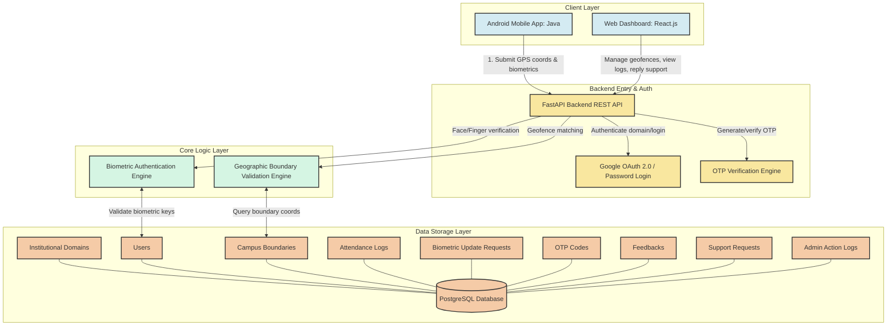

# Geo-Attend System Architecture

---

## Architectural Breakdown

### 1. Client Layer
- **Android Mobile App (Java):** Front-facing client application used by employees to perform verification. Queries device GPS coordinates and biometric hardware APIs (Face/Fingerprint) to send verification payloads.
- **Web Dashboard (React.js):** Management console used by administrators to manage geofenced campus zones, view logs, manage user settings, resolve support requests, and inspect admin action audit logs.

### 2. Backend Entry & Auth Layer
- **FastAPI Backend REST API:** Python-based REST API serving client requests. Uses Pydantic for request/response serialization.
- **Authentication Engine:** Validates Google OAuth 2.0 logins or email/password credential pairs.
- **OTP Verification Engine:** Handles email OTP generations and verification challenges for password resets and signup registrations.

### 3. Core Logic Layer
- **Geographic Boundary Validation Engine:** Uses the Haversine formula to compute the physical distance between user GPS coordinates and active organizational geofences to verify bounds.
- **Biometric Authentication Engine:** Validates mobile biometric check-ins against registered face profiles and biometric public keys.

### 4. Data Storage Layer
A PostgreSQL database containing 9 structured tables:
- **Institutional Domains:** Domain constraints whitelist.
- **Users:** Admin and employee profiles.
- **Campus Boundaries:** Geofence locations and radii.
- **Attendance Logs:** Clock-in/out stamps and geofence distance results.
- **Biometric Update Requests:** Audited face/finger update applications.
- **OTP Codes:** Security OTP challenges database.
- **Feedbacks & Support Requests:** Channels for employee communication and administrator resolution.
- **Admin Action Logs:** Unalterable administrative audits.